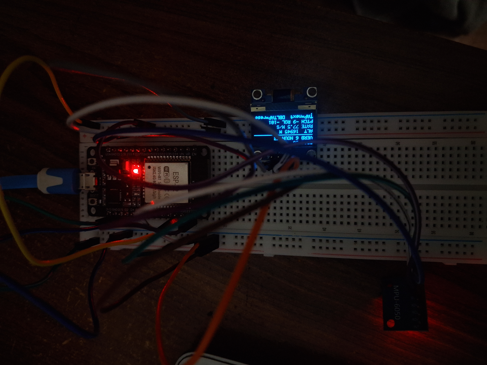

# MoonKnight - Apollo 11 Lunar Descent Simulation using ESP32

A hardware simulation of the Apollo Guidance Computer's DSKY (Display and
Keyboard) interface and the final descent programs of the Apollo 11 landing,
built on an ESP32 with an MPU6050 IMU and an SSD1306 OLED. There are no
physical buttons — all control is via tap gestures detected through the
accelerometer.

This is a fork of [chrislgarry/apollo-11](https://github.com/chrislgarry/apollo-11),
which contains the original 1960s AGC assembly source. This project does not
port that code — it isn't portable, since the AGC is a completely different
15-bit-word architecture with no equivalent on a modern microcontroller.
Instead, this reproduces the *behavior*: the verb/noun display convention,
the sequence of real descent programs, and the role of the crew's PRO
(Proceed) key — now replaced by a tap gesture.

## Table of contents

- [Hardware](#hardware)
- [Wiring](#wiring)
- [Libraries](#libraries)
- [How it works](#how-it-works)
  - [Mission programs](#mission-programs)
  - [Verb/Noun display](#verbnoun-display)
  - [Control: tap gestures](#control-tap-gestures)
  - [Attitude and the descent model](#attitude-and-the-descent-model)
  - [Program alarms](#program-alarms)
- [Building and flashing](#building-and-flashing)
- [Troubleshooting](#troubleshooting)
- [Repository structure](#repository-structure)
- [Extending it](#extending-it)
- [License and attribution](#license-and-attribution)

## Demo

Wiring done on a full sized bread board. 3v3 and GND connected to rails with D21 and D22 on opposite rails.

## Hardware

| Part | Notes |
|---|---|
| ESP32 dev board | Any variant with exposed GPIO21/GPIO22 |
| MPU6050 | I2C accelerometer + gyroscope breakout (GY-521 or similar) |
| SSD1306 OLED | 0.96", 128x64, I2C |

No buttons, no external pull-up resistors — both I2C modules use their
onboard pull-ups (typical of breakout boards).

## Wiring

Both I2C devices connect directly to the ESP32, sharing the bus:

| ESP32 | OLED | MPU6050 |
|---|---|---|
| 3.3V | VCC | VCC |
| GND | GND | GND |
| GPIO21 (SDA) | SDA | SDA |
| GPIO22 (SCL) | SCL | SCL |

The OLED (address `0x3C`) and MPU6050 (address `0x68`) coexist on the same
bus without conflict, since I2C is a shared, addressed bus by design.

## Libraries

Install via Arduino IDE Library Manager:

- **Adafruit SSD1306**
- **Adafruit GFX Library**
- **MPU6050_light** (by rfetick) — handles gyro/accelerometer fusion
  internally, so no manual complementary filter is needed in the sketch

## How it works

### Mission programs

The sketch models the sequence of programs the Apollo 11 crew actually ran
during descent, shown on-screen as `PROG XX`:

| Program | Meaning |
|---|---|
| `P00` | Standby |
| `P63` | Braking Phase |
| `P64` | Approach Phase |
| `P66` | Rate of Descent (manual-style) |
| `P68` | Landing confirmed |

### Verb/Noun display

The DSKY's `VERB`/`NOUN` pair is reproduced using real codes from the
mission: `V16N63` (altitude, altitude rate, forward velocity) is shown during
`P63`, the same code Buzz Aldrin was calling out during the actual braking
phase.

### Control: tap gestures

There are no buttons. The MPU6050's accelerometer magnitude is monitored for
sharp jerks against gravity's baseline (~9.8 m/s²):

- **Single tap** → PRO (advance to the next mission phase, or acknowledge a
  program alarm if one is active)
- **Double tap** (within `DOUBLE_TAP_WINDOW_MS`, default 500ms) → MODE
  (full mission reset)

Because the code needs a short window to distinguish a single tap from the
first half of a double tap, there's a deliberate ~500ms delay before a single
tap registers. `TAP_THRESHOLD` (default `4.0`, in m/s² above gravity) is the
main value to tune — raise it if normal tilting falsely triggers phase
advances, lower it if deliberate taps aren't registering.

### Attitude and the descent model

Pitch and roll come directly from `MPU6050_light`'s built-in sensor fusion
(`getAngleX()` / `getAngleY()`), which blends gyroscope and accelerometer
data internally.

Tilting the board forward (positive pitch) increases simulated braking
thrust against a modeled lunar gravity of 1.62 m/s². The relationship is
intentionally simplified — this is not orbital-mechanics-accurate — but the
shape of the feedback (tilt more, descend slower) mirrors how the LM's
descent engine and attitude control worked together.

`mpu.calcOffsets()` runs once during `setup()` and requires the board to be
still and roughly level for a couple of seconds while it calibrates; the
Serial monitor prints a message when this starts and finishes.

### Program alarms

During `P63`/`P64`, there's a small random chance of a `PROG ALARM 1202`
banner appearing on screen — a reference to the real 1202/1201 program
alarms during the Apollo 11 landing (an executive overflow: the AGC was
being asked to do more than it had cycles for, but its priority scheduling
kept the critical guidance tasks running). A single tap acknowledges it and
continues, the same way mission control instructed the crew to proceed
through the real alarms.

## Building and flashing

1. Install the Arduino IDE and the ESP32 board package.
2. Install the three libraries listed above via Library Manager.
3. Open `apollo_dsky_sim/apollo_dsky_sim.ino`.
4. Select your ESP32 board and port, then upload.
5. Open Serial Monitor at `115200` baud to see calibration and any
   connection diagnostics.
6. Keep the board still during the "Calibrating MPU6050" step.
7. Tap the board once it shows `TAP BOARD TO START`.

## Troubleshooting

If the MPU6050 doesn't initialize (`MPU6050 not found, retrying...`
repeating in Serial), use the standalone I2C scanner in this repo
(`i2c_scanner/i2c_scanner.ino`) to check what the bus actually sees:

- **Neither `0x3C` nor `0x68` found** — wiring or power problem. Check for
  continuity along your connections and confirm actual voltage at VCC with a
  multimeter (should read 3.3V, not 5V).
- **`0x3C` found, `0x68` missing** — the OLED's connection is fine; the
  problem is specific to the MPU6050 (wiring, or a bad module).
- **`0x69` instead of `0x68`** — the MPU6050's `AD0` pin is floating high or
  tied to VCC; pull it to GND for the standard `0x68` address, or adjust the
  address in code if you'd rather keep it at `0x69`.
- **Both addresses found by the scanner, but the main sketch still fails** —
  try lowering `Wire.setClock()` further (e.g. to `50000`), since the
  scanner's simple presence-ping is less demanding than a full register read.

## Repository structure

```
apollo-11/                     <- fork of the original AGC source repo
├── (original AGC source files, untouched)
├── apollo_dsky_sim/
│   ├── apollo_dsky_sim.ino    <- main firmware
│   └── README.md              <- this file
└── i2c_scanner/
    └── i2c_scanner.ino        <- standalone I2C diagnostic sketch
```

## Extending it

- Add a buzzer for the DSKY's key-click and alarm tones.
- Log each run's descent profile over Serial to compare landings.
- Reference the original AGC source's actual verb/noun tables to expand
  beyond `V16N63` for other phases.
- If you add physical buttons back later, a real verb/noun keypad entry mode
  (matching the AGC's actual input protocol) would be a natural next step.

## License and attribution

This project's own files (`apollo_dsky_sim/`, `i2c_scanner/`, this README)
are original work built for this simulation. They live inside a fork of
`chrislgarry/apollo-11`, whose original AGC source retains its own license
and historical provenance — see that repository's license file for terms
covering the original assembly source.
